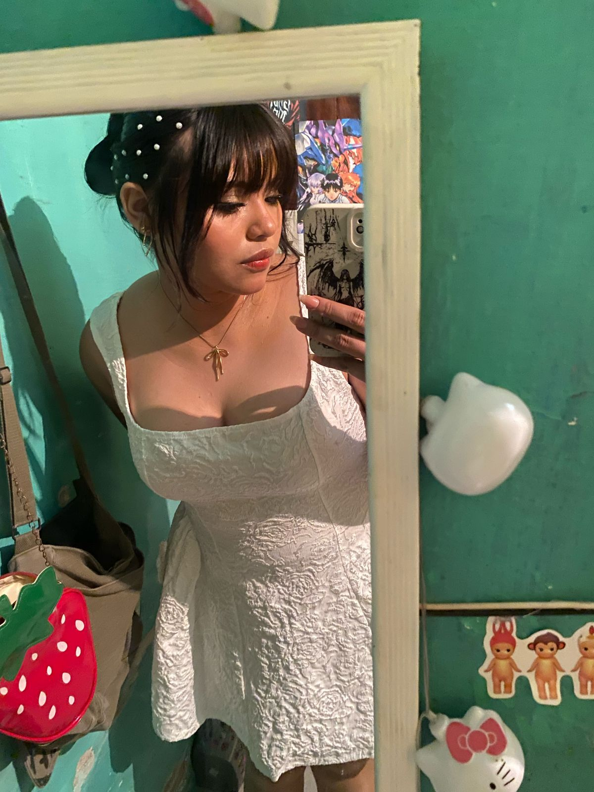

<!DOCTYPE html>
<html lang="es">
<head>
    <meta charset="UTF-M">
    <meta name="viewport" content="width=device-width, initial-scale=1.0">
    <title>Una Carta Especial</title>
    
</head>
<body>

    

        <h1>Una Carta Solo Para Ti</h1>

        
Hola mi amor,

        

             se que aveces parezco molesto o fastidiado pero no solo quiero estar todo el día acostado contigo y que me abraces  y  se que piensas que me arrepiento de todo, pero no es así, estoy feliz, es mi momento más feliz de todos los tiempos, nunca he sido la mejor persona del mundo, solo no encontraba algo que realmente me hiciera sentir algo bueno siempre me daba asco y quería irme del lugar o así y tú fuiste la única persona con la que me he sentido comodo, el único lugar al que siempre quiere estar, eres la única cosa que repitiria una y otra vez, no cambiaría nada todo lo que hemos pasado es un momento especial si tuviera la habilidad de volver en el tiempo volvería cada vez a experimentar todo lo  que hemos compartido me quedaría contigo un tiempo infinito.
        

        

         Se que has pasado momentos malos horribles realmente, se que te han traicionado y te irieron te han hecho sentir poco amor, yo no sere así me niego a serlo, seré la persona que se quede contigo hasta el final de nuestros días hasta que nuestro corazones dejen de latir, solo quisiera poder fundirme contigo y nunca separarnos quisiera que todo lo malo del mundo se fuera,quisiera que pudiéramos hacer lo que quisiéramos juntos solo nosotros dos y la bebé .
        

"no soy la persona más hermosa mi amor, se que no soy tu tipo, he Sido un mal novio un mal esposo perdón por no poder ser suficiente (⁠╥⁠﹏⁠╥⁠), ojalá ser perfecto para ti y que me veas y digas es perfecto, solo quisiera poder hacerte sentir muy bien que siempre tuvieras una sonrisa en tu cara "
        

            <h2>📁 fotitos (⁠◍⁠•⁠ᴗ⁠•⁠◍⁠)⁠❤</h2>

            

                

                    
                    

                        <strong>te amo</strong>
                        
❤️

                    

                

                

                    
                    

                        <strong>te ves tan linda mi amor </strong>
                        
eres tan perfecta cariño eres como esos días de frio en los que te dan ganas de beber café y leer 

                    

                

                

                    
                    

                        <strong>Eres ese momento al que siempre volvería amor</strong>
                        
Te amo 💕💕💕💕💕💕💕.

                    

                

                

        

        

            te amo mi amor gracias por estar a mi lado  mi niña 
        </loc>
        

             
        

        

            [Oscar]
        

        

</body>
</html>

</body>
</html>
